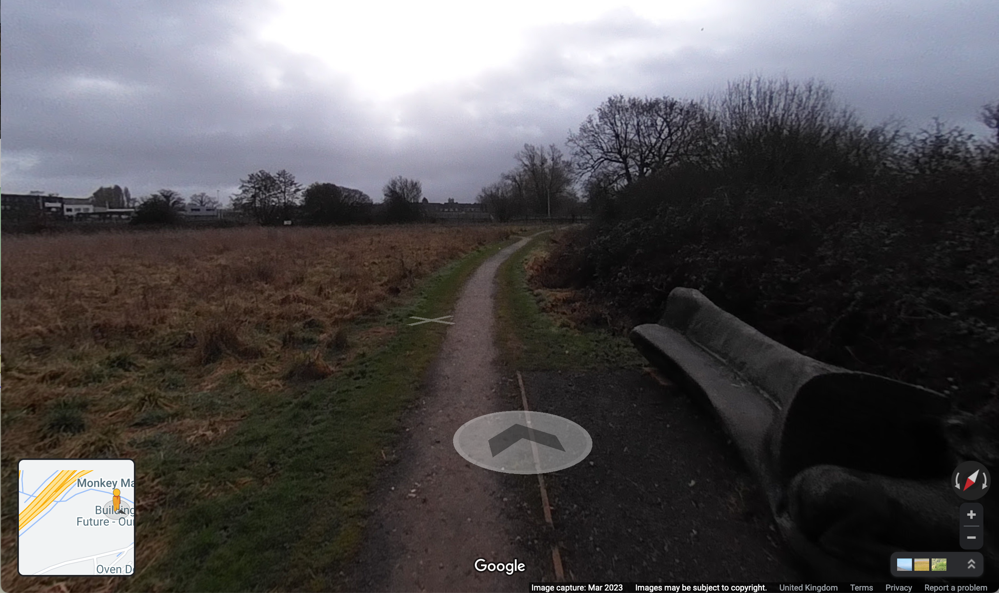
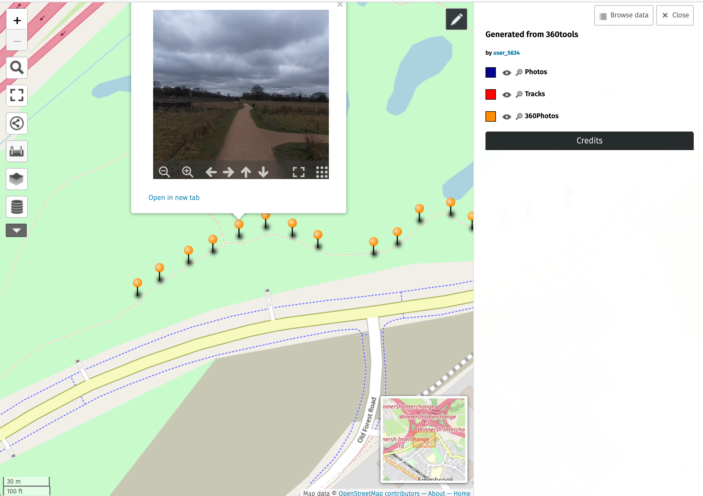

# 360tools

Tools to help publish 360 degree JPEG photos

## Introduction

Publishing 360 degree JPEG photos ( otherwise known as Photo Spheres ) can be tricky -

* A simple upload to [Google Maps](https://www.google.com/maps) (web or app) via the Contributions feature [replaces the image location with the location of the Place](https://support.google.com/maps/thread/205885261?hl=en)
* [Google Street View app](https://play.google.com/store/apps/details/?id=com.google.android.street&gl=US) has been deprecated
* [Google Street View Studio](https://streetviewstudio.maps.google.com/) only works with mp4s, even then takes a long time to process
* [Google My Maps](https://www.google.com) doesn't support 360 photos and has limits per layer
* [OpenStreetMap's umap](https://umap.openstreetmap.fr/en/) works well, but can be tricky to configure 360 images

360tools is a command-line tool to process and upload 360 degree photos generated by 360 degree cameras.

## Features

* Invoke [Googles Places API](https://developers.google.com/maps/documentation/places/web-service/overview) to display points of interest near photo locations
* Prepare and upload photos to Google Maps
  * Use [Googles Oauth2 API](https://developers.google.com/identity/protocols/oauth2) to authenticate uploads
  * Extracts location, time and altitude data from photos
  * Use [Googles StreetViewPublish API](https://developers.google.com/streetview/publish/reference/rest) to upload the photos
  * Generates photo metadata
  * Generates photo connections - the first photo links to the second, second to the third etc
  * Generates photo heading - each photo is pointed at the location of the next
  * Use [Googles StreetViewPublish API](https://developers.google.com/streetview/publish/reference/rest) to upload the metadata
* Option to use a GPX track to obtain missing location information
* Generate [uMap](https://umap.openstreetmap.fr/en/) files ( requires hosting photos on a web server )

## Google credentials

Before interacting with Google, you will need to create an **API key** and an **OAuth 2.0 Client ID** from the [Google Cloud Dashboard](https://console.cloud.google.com/apis/dashboard).

* Create a **API Key** and restrict the key to only access the **Places API**.  Save the key in file **apikey.dat**.
* Create a **Client ID** for **Web Application** and add **http://127.0.0.1** to the **Authorized redirect URIs**.  Save the Client ID in file **clientid.dat** and the Client secret in **clientsecret.dat**.

## Uploading photos to Google Maps

Run the tool with the list of JPG photos to upload -

```
360tools-darwin *.JPG
2023/03/23 12:44:39 need to renew new access token
2023/03/23 12:44:39 Authorize this app at: https://accounts.google.com/o/oauth2/auth?client_id=...
```

At this point a browser window should appear promting you to authenticate to your Google account.
Once done, the tool will continue.

```
2023/03/23 12:44:45 Got code: ...
2023/03/23 12:44:45 R0010165.JPG: Timestamp 2023-03-12 09:26:54 +0000 GMT
2023/03/23 12:44:45 R0010165.JPG: Latitude 51.427569, Longitude -0.855367
2023/03/23 12:44:45 R0010165.JPG: Altitude 92.700000
2023/03/23 12:44:48 R0010165.JPG: Uploaded
2023/03/23 12:44:49 R0010165.JPG: Created metadata with id CAoSLEFGMVFpcFBpNmtYcnlkZjBhVHk3SG5mbkdhbXRUcVdIWUxSLUdYdVZHM2dv
2023/03/23 12:44:49 R0010166.JPG: Timestamp 2023-03-12 09:27:07 +0000 GMT
2023/03/23 12:44:49 R0010166.JPG: Latitude 51.427622, Longitude -0.855147
2023/03/23 12:44:49 R0010166.JPG: Altitude 92.700000
2023/03/23 12:44:52 R0010166.JPG: Uploaded
2023/03/23 12:44:53 R0010166.JPG: Created metadata with id CAoSLEFGMVFpcFA5Q2VKZWxwMnYzMERHYnpxN0dwZl9zTVg1eGxhX2FlMC0yeG5j
...
2023/03/23 12:47:30 CAoSLEFGMVFpcFBpNmtYcnlkZjBhVHk3SG5mbkdhbXRUcVdIWUxSLUdYdVZHM2dv: Waiting to be published
2023/03/23 12:47:31 CAoSLEFGMVFpcFA5Q2VKZWxwMnYzMERHYnpxN0dwZl9zTVg1eGxhX2FlMC0yeG5j: Waiting to be published
...
2023/03/23 12:48:03 CAoSLEFGMVFpcFBpNmtYcnlkZjBhVHk3SG5mbkdhbXRUcVdIWUxSLUdYdVZHM2dv: Connect to next CAoSLEFGMVFpcFA5Q2VKZWxwMnYzMERHYnpxN0dwZl9zTVg1eGxhX2FlMC0yeG5j, bearing 68.956884
2023/03/23 12:48:04 CAoSLEFGMVFpcFA5Q2VKZWxwMnYzMERHYnpxN0dwZl9zTVg1eGxhX2FlMC0yeG5j: Connect to previous CAoSLEFGMVFpcFBpNmtYcnlkZjBhVHk3SG5mbkdhbXRUcVdIWUxSLUdYdVZHM2dv and next CAoSLEFGMVFpcE4xLXpyb1hpdHFPbVZ0SkZLbi0xTWhNOTQ2UmpNbnpIVnlyaFZL, bearing 47.354476
...
```

These photos should appear on Google Maps ( when **Street View** detail is enabled ) as blue dots.  Arrows should be be available to navigate from one photo to the next.
Note that it can take a bit of time to appear.

However the photos will not be associated with any Google Place.




## Uploading photos to Google Maps and add to a Google Place

First run the tool to get a list of nearby places -

```
360tools-darwin --pois *.JPG
2023/03/23 14:48:27 ChIJ34aXR8ODdkgRSPYmPPFK6RM: PJM Roofing
2023/03/23 14:48:27 ChIJB2vKz_mDdkgRIKm50jzhTGk: Old Forest Meadows
2023/03/23 14:48:27 ChIJR-N9NBODdkgRDV3BgOGyCMU: Oven Doctor - Oven Cleaning Wokingham
...
```

Then pass the Place ID to the upload -

```
360tools-darwin --placeid ChIJB2vKz_mDdkgRIKm50jzhTGk *.JPG
...
```

The photos should now be assoicated with a Google Place.

## Generating uMap configurations

Run the tool with the Umap options -

```
360tools-darwin --map-type umap --web-url https://plord.co.uk/360test *.JPG
2023/03/25 09:02:57 uMap files have been generated in umap directory
2023/03/25 09:02:57 To use in uMap :
2023/03/25 09:02:57 1. Copy photos, html pages and csv files to https://plord.co.uk/360test
2023/03/25 09:02:57 2. On uMap server, click "Create a map"
2023/03/25 09:02:57 3. Click "Edit map settings" ( cog wheel ), "Advanced actions" then "Empty"
2023/03/25 09:02:57 4. Click "Import data" ( up arrow ), browse and upload photos.umap then "Import"
2023/03/25 09:02:57 5. Click "Save" and "Disable editing"
```

The umap directory now contains -

* Copy of photos
* html wrapper for each photo
* csv file for 360 photos
* csv file for non-360 photos
* uMap configuration file

The output of the tool gives instructions what to do with these files.

Tracks can also be specified - these are combined into a single `tracks.gpx` file that should also be placed on the web server -

```
360tools-darwin --map-type umap --web-url https://plord.co.uk/360test *.JPG *.gpx
```



## Obtaining location data from GPX trace

If the photo doesn't contain any location data the following is reported -

```
2023/03/23 20:00:19 nolocation.JPG: Unable to get metadata: exif: tag "GPSLongitude" is not present
```

However, if a [GPX track](https://en.wikipedia.org/wiki/GPS_Exchange_Format) is recorded at the same time as the photo(s) are taken
( for example from a handheld GPS or a phone app such as [OsmAnd](https://osmand.net/)) , the timestamps can
be compared and the location inferred -

```
360tools-darwin --placeid ChIJB2vKz_mDdkgRIKm50jzhTGk --gpx-file 2023-03-10_12-05_Fri.gpx *.JPG
...
```

Alternatively, you can use `exiftool` to update the photos from GPX -

```
exiftool -geotag ../2023-03-10_12-05_Fri.gpx *JPG
   15 image files updated
```

## Testing

This tool has only been lightly testing on my Mac ... whilst I can build binaries for other platforms, I don't have an easy way to test these.

## Beer

Whilst this tool is open source, if you like it please consider buying me a beer :-)

Bitcoin: `bc1qmk597c92k47uvnw2wksxu40utlazuwpkzuhdy0`

Etherium: `0xf9861c776B2EC33560f5cB7D7af3cd259dFA5AB6`

Tether: `0xf9861c776B2EC33560f5cB7D7af3cd259dFA5AB6`

[](https://paypal.me/plord12?country.x=GB&locale.x=en_GB)